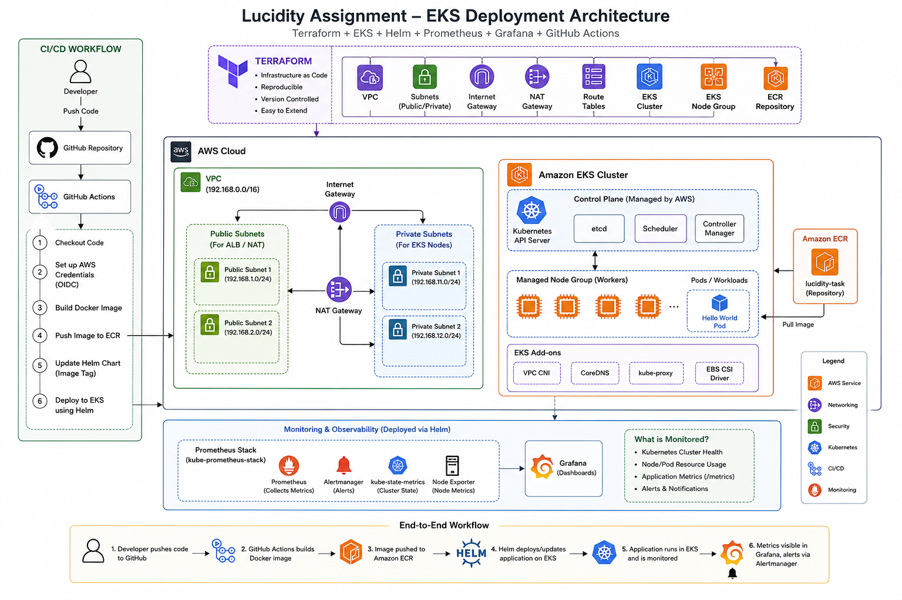
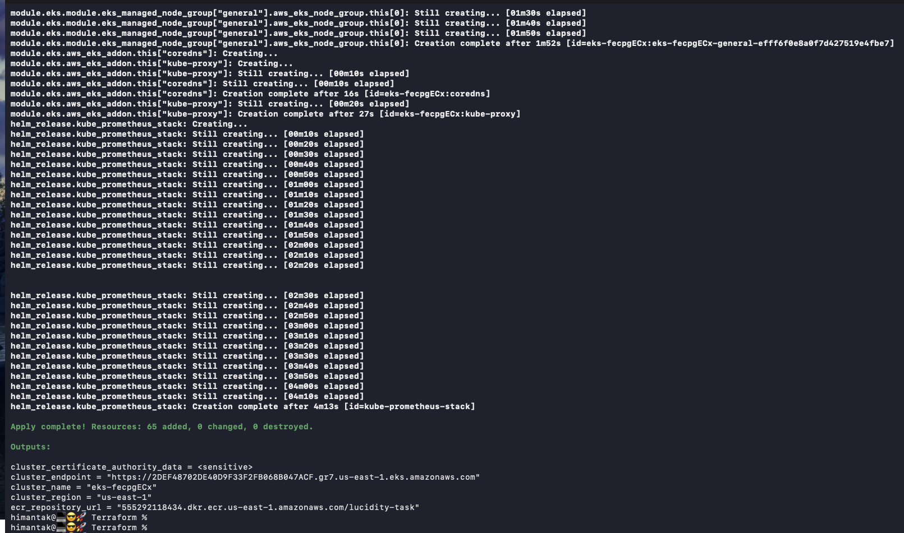
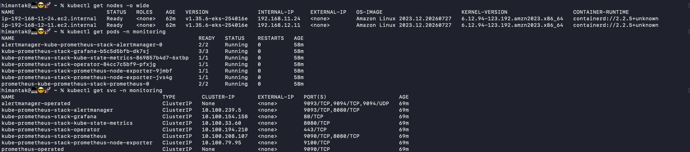
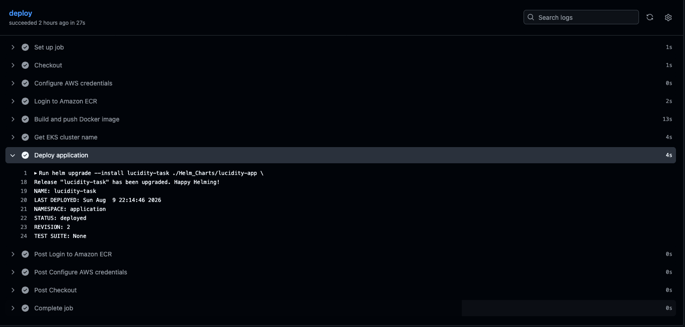
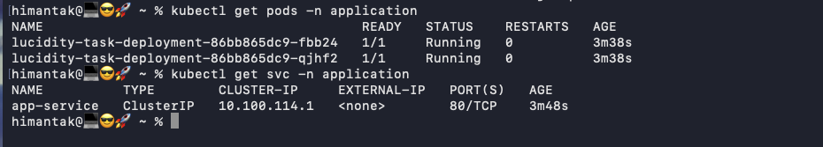
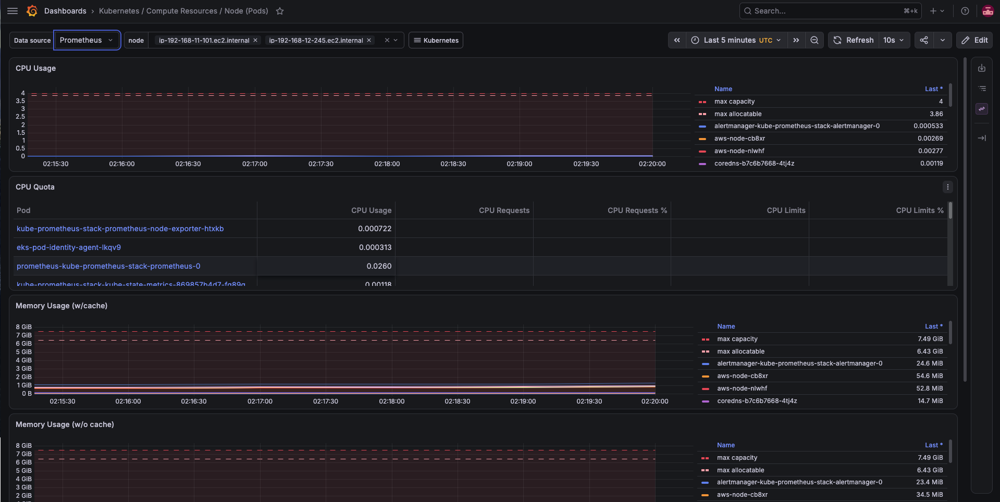
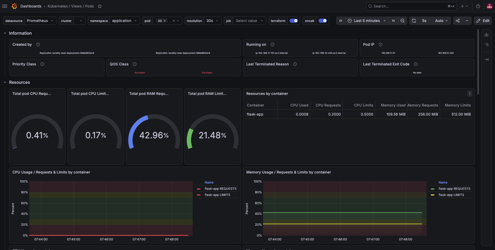

# Lucidity – EKS Deployment Assignment

A production-oriented Kubernetes platform built to run a Hello World microservice on Amazon EKS, with the infrastructure, application deployment, observability, and CI/CD workflow managed as code. The AWS infrastructure is provisioned using Terraform, including the VPC, public/private networking, EKS cluster, managed node groups, EKS add-ons, and Amazon ECR. The application is containerized using Docker and packaged as a reusable Helm chart for deployment to Kubernetes. The platform is integrated with Prometheus and Grafana for application and cluster observability, providing visibility into workload health, resource utilization, and Kubernetes metrics. GitHub Actions is used to automate the application build, container image publishing, and deployment to EKS.

The design focuses on repeatable infrastructure, controlled access, scalability, operational visibility, and clear separation between infrastructure and application deployment, while keeping the setup simple enough to reproduce end-to-end.

The implementation is split into the following layers:

| # | Layer | What it covers |
|---|-------|----------------|
| 1 | **AWS Infrastructure** | VPC, Subnets, Security Groups NAT Gateway, ECR and EKS |
| 2 | **Kubernetes Platform** | EKS managed node group and required cluster add-ons |
| 3 | **Application** | Python-based HTTP service returning `Hello World` |
| 4 | **Application Packaging** | Docker image and Helm chart |
| 5 | **Observability** | Prometheus, Grafana, Alertmanager, kube-state-metrics and Node Exporter |
| 6 | **CI/CD** | GitHub Actions workflow to build the image and deploy it to EKS |

---

## Contents

- [1. Architecture](#architecture)
- [2. AWS Infrastructure - Terraform](#terraform)
- [3. CI/CD Pipeline - GitHub Actions](#cicd)
- [4. Monitoring - Prometheus & Grafana](#monitor)
- [5. Conclusion](#conclusion)

<a id="architecture"></a>
## 1. Architecture

The following diagram shows the complete flow from infrastructure provisioning and source-code changes through container publishing, Helm deployment, application execution, and monitoring.

<p align="center">
  
</p>

### Architecture Overview:

The architecture follows an end-to-end flow from infrastructure provisioning to application deployment and observability. Terraform provisions the AWS foundation, including the VPC, public/private subnets, networking components, EKS cluster, managed node group, EKS add-ons, and ECR repository. Worker nodes run inside private subnets, while public subnets provide connectivity for components that require internet-facing access.

For application delivery, a developer pushes code to GitHub, triggering GitHub Actions. The pipeline builds the Docker image, pushes it to Amazon ECR, updates the application deployment with the new image, and deploys it to the EKS cluster using Helm.

Inside EKS, the Hello World application runs as Kubernetes pods managed through the Helm chart. Prometheus collects Kubernetes and application metrics, while Grafana provides dashboards for cluster and application health. Alertmanager handles alerts generated by the monitoring stack.

This separation keeps infrastructure provisioning, application packaging, deployment, and observability independently manageable, while providing a repeatable path from a code change to a monitored workload running on EKS.


<a id="terraform"></a>
## 2. AWS Infrastructure – Terraform

Terraform is used to provision the complete AWS infrastructure required to run the application on Amazon EKS. The infrastructure is defined as code and can be recreated consistently across environments without manually configuring individual AWS resources.

The Terraform configuration provisions the following components:

* **VPC** with public and private subnets across multiple Availability Zones.
* **Internet Gateway and NAT Gateway** for inbound/outbound network connectivity.
* **Route tables and subnet associations** for controlled traffic routing.
* **Security groups** for controlling network access to the infrastructure.
* **Amazon EKS cluster** with a managed Kubernetes control plane.
* **EKS managed node group** running worker nodes in private subnets.
* **EKS add-ons** such as VPC CNI, CoreDNS, kube-proxy and Pod Identity Agent.
* **Amazon ECR repository** for storing application container images.
* **EKS access configuration** for controlled cluster authentication and authorization.
* **Helm provider configuration** to allow Terraform to install Kubernetes/Helm-based components after the cluster is available.

The infrastructure is intentionally separated into logical Terraform files so that networking, EKS, container registry, Helm components, and monitoring configuration can be maintained independently.

### Infrastructure Design

The basic infrastructure flow is:

```text
Terraform
   │
   ├── VPC & Networking
   │    ├── Public Subnets
   │    ├── Private Subnets
   │    ├── Internet Gateway
   │    ├── NAT Gateway
   │    └── Route Tables
   │
   ├── Amazon EKS
   │    ├── Control Plane
   │    ├── Managed Node Group
   │    ├── EKS Add-ons
   │    │    ├── VPC CNI
   │    │    ├── CoreDNS
   │    │    ├── kube-proxy
   │    │    └── Pod Identity Agent
   │    │
   │    └── EKS Access Entries
   │         └── GitHub Actions
   │
   ├── Amazon ECR
   │    └── Application Container Images
   │
   └── Helm Provider
        │
        │  After EKS cluster is ready
        ▼
   Helm Release
        │
        └── kube-prometheus-stack
             ├── Prometheus
             ├── Grafana
             ├── Alertmanager
             ├── kube-state-metrics
             └── Node Exporter
```

Worker nodes are placed in **private subnets**, while the networking layer provides the required connectivity through the NAT Gateway. The EKS configuration uses managed node groups so that node lifecycle management remains with AWS while still allowing capacity and instance types to be adjusted through Terraform variables. This approach provides a **repeatable and extensible foundation** for the application and monitoring components deployed later in the workflow.

<p align="center">
  
</p>

### Monitoring Stack Provisioning

The monitoring stack is also managed through Terraform to keep the complete platform provisioning automated and reproducible.

Once the EKS cluster and its worker nodes are successfully created, Terraform uses the **Helm provider** and a `helm_release` resource to install the **kube-prometheus-stack** Helm chart directly into the cluster.

The monitoring stack includes:

* **Prometheus** – collects Kubernetes and application metrics.
* **Grafana** – provides dashboards for visualization and troubleshooting.
* **Alertmanager** – handles alerts generated by Prometheus.
* **kube-state-metrics** – exposes Kubernetes object and workload state metrics.
* **Node Exporter** – collects node-level resource metrics.

This means there is no separate manual Helm installation step after creating the cluster. Running Terraform provisions the AWS infrastructure first and then bootstraps the monitoring components once the Kubernetes cluster is available.
<p align="center">
  
</p>

<a id="cicd"></a>
## 3. CI/CD Pipeline – GitHub Actions:

GitHub Actions is used to automate the deployment of the Python Flask application to EKS. A push to the `main` branch triggers the workflow defined in `.github/workflows/deploy.yaml`.

The pipeline performs the following steps:

1. **Checkout** – Fetches the application source code.
2. **AWS Authentication** – Uses GitHub OIDC to authenticate with AWS without storing long-lived AWS access keys.
3. **Build & Push** – Builds the Docker image and pushes it to the Amazon ECR repository.
4. **Image Versioning** – The image is tagged using the Git commit SHA, making each deployment traceable to a specific code version.
5. **EKS Access** – Configures `kubectl` to connect to the EKS cluster using the IAM identity configured through the EKS access entry.
6. **Helm Deployment** – Runs `helm upgrade --install` with the newly built image repository and tag.

### CI/CD Flow

```text
Developer
    │
    │ Push to main
    ▼
GitHub Actions
    │
    ├── AWS OIDC Authentication
    │
    ├── Docker Build
    │
    ├── Push Image ───────────► Amazon ECR
    │                              │
    │                              │ Image: <git-sha>
    │                              ▼
    └── Helm Upgrade/Install ──► Amazon EKS
                                   │
                                   ▼
                              Flask Application
```

Using the Git commit SHA as the image tag avoids relying on a mutable `latest` tag and makes it easier to identify the exact application version running in the cluster.

The infrastructure and cluster access are managed by **Terraform**, while **GitHub Actions handles the application delivery**, keeping infrastructure provisioning and application deployment separate.

<p align="center">
  
</p>
<p align="center">
  
</p>

<a id="monitoring"></a>
## 4. Monitoring – Prometheus & Grafana

The EKS cluster is monitored using the **kube-prometheus-stack**, installed through the Terraform `helm_release` resource after the EKS cluster is successfully provisioned.

The stack provides:

* **Prometheus** – Collects metrics from the Kubernetes cluster and application workloads.
* **Grafana** – Provides dashboards to visualize cluster and application health.
* **Alertmanager** – Handles alerts generated by Prometheus rules.
* **kube-state-metrics** – Provides metrics about Kubernetes resources and workload state.
* **Node Exporter** – Collects node-level CPU, memory and filesystem metrics.

### Monitoring Flow

```text
                  Amazon EKS
                      │
          ┌───────────┴───────────┐
          │                       │
    Application Pods          Worker Nodes
          │                       │
          │                       │
          └──────────┬────────────┘
                     │
                     ▼
                Prometheus
                     │
             ┌───────┴───────┐
             │               │
             ▼               ▼
          Grafana        Alertmanager
             │               │
             ▼               ▼
        Dashboards         Alerts
```

Prometheus provides the metrics collection layer, while Grafana is used to visualize the collected data. This provides visibility into **application availability, pod health, node resources, and overall Kubernetes cluster health**, helping identify issues before they affect the application.

The monitoring stack is managed as part of the Terraform provisioning process, so no separate manual installation is required after creating the EKS cluster.

#### Grafana Node Monitoring Dashboard
<p align="center">
  
</p>
  
#### Grafana Pod Monitoring Dashboard
<p align="center">
  
</p>


<a id="conclusion"></a>
## 5. Conclusion:

This implementation covers the complete application delivery lifecycle, from **infrastructure provisioning to application deployment and monitoring**.

Terraform provides a repeatable AWS and EKS foundation, while GitHub Actions automates the application build, container publishing, and Helm-based deployment. Prometheus and Grafana provide visibility into the application and Kubernetes platform, helping identify issues before they impact the service.

The setup is designed to be **repeatable, extensible, and easy to operate**, with infrastructure, application deployment, access configuration, and monitoring maintained as code. The complete implementation, including Terraform configuration, application source, Dockerfile, Helm chart, monitoring configuration, and GitHub Actions workflow, is available in this repository.
